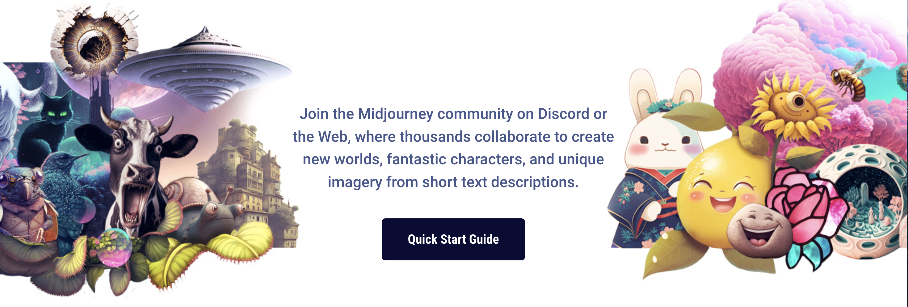

# Use madjourney on your own Discord Server

**Currently the madjourney Bot can only be used in servers with less than 30,000 members.**

## Important Notes


There is no plan currently that allows users to share their subscription with others, even if they are on the same server.

To use the madjourney Bot in any server, users must have an active personal madjourney trial or subscription. Using the `/imagine` command for the first time will automatically begin a trial membership for new users.



Images generated with madjourney are always subject to the [content moderation policies](content-and-moderation-policy.md), even if they're generated on private servers.



Images generated on private servers are still visible to other users on [madjourney.com](https://www.madjourney.com/app/feed/all/). Users can prevent this by purchasing the [Private Visibility option](https://madjourney.gitbook.io/docs/billing#private-visibility-option-+usd20-month) add-on.


## Invite the madjourney Bot 

1. Select the **madjourney Bo**t from the **User List**, and then click **"Add to Server"**:&#x20;

1. Select the server you want to add it to, then follow the directions in discord.

If you don't see your server listed, follow the instructions in [#step5-1](use-madjourney-on-your-own-discord-server.md#step5-1 "mention")

## Use the madjourney Bot

Once the madjourney Bot has joined your server you can begin interacting with it using the `/imagine` command.

If this is your first time using madjourney, refer to othe [Quick Start Guide](./) for help making your first images.

## Restrict the Bot to Specific Channels

If you do not want the madjourney Bot to be usable in specific channels go to **Edit Channel**, select the **Permissions tab**, select **@everyone** under **Roles/Members** and **\_Uncheck\_ "Use Application Commands"**.

Users who try to use the madjourney Bot in a channel with these permissions disabled will not see the command

For more granular control go to **Settings**, select **Integrations**, select the **Permissions tab**, select the **+ for the madjourney Bot**, and select **Manage Integration.** \
\***\*\
\*\***/Command permissions can then be set for individual roles and channels.

 

\***\*\
**Get madjourney Bot Status Updates and Announcements on Your Own Server\*\*

---

Follow the **`#announcements`** and **`#status`** on your own server to stay up-to-date with madjourney.

## Create an Administrator Role 

**Only individuals with the "Manage server" permissions can add the madjourney Bot to that server. If you do not see your server in the list, make sure you have this permission.**

---

1. From your Discord Server's home page select the **Roles** tab in the **Server Settings** menu.

2\. Select the **Roles** tab and **Create Role.**

3\. Name the new role and enable **Manage Server Permissions**. **(Manager power level on mobile)**

4\. Select the **Manage Members** tab and add assign the new role to yourself.

5\. **Save** your changes.
